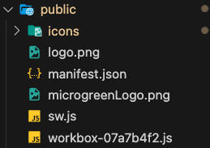

# PWA

## Why a Progressive Web App?
Going into this project, there was an apparent need for users to be able to access this service via their mobile phones. In addition, there is also a need for a desktop/web version for the service technicians, and also because the charted data better readable on a larger screen.

With so many different platforms, maintainability becomes an issue as we would ideally want to have as less codebases as possible. We need a version for the web, android and iOS. One step in the right direction is to use a cross platform app development framework like React Native. React native can be used to build web apps, but it's native-first approach makes this a little difficult.

The solution that was chosen were Progressive Web Apps (PWAs). Essentially, PWAs are just websites that leverage service workers to allow them to be installed on a mobile device.

PWAs were chosen over React Native because of several reasons:
- Distribution
	- Users could just visit the PWA site and install the app, no need to go through the app store or create a site to host the APK
	- Updates are pushed to the user immediately, not requiring a reinstall or download
- Ease of development
	- React Native although being very similar to React, has it's own quirks and features. Using PWAs allows us to use React, which is by far has better developer support
	- In addition, there is a better chance that future SWEs who pick up this project have experience in React compared to React native

## External Resources
- [PWA's in 100s](https://youtu.be/sFsRylCQblw?si=LYmpNFaPduXdLRu_)
- [PWA's with Next.js](https://medium.com/@livajorge7/next-js-pwa-the-ultimate-guide-to-building-progressive-web-apps-aaa65bf18cf3)
- [Getting started with next-pwa](https://ducanh-next-pwa.vercel.app/docs/next-pwa/getting-started)
- [PWA Asset Generator](https://www.npmjs.com/package/pwa-asset-generator)

## Tidbits
The manifest.json file which is required for a PWA also needs some image assets for the app icon and the splash screen. Here are some helpful tips:

Command to generate splash icons:
```bash
npx pwa-asset-generator ./public/logo.png ./public/icons --opaque false --padding "15%"
```
Note: Make sure that you have a logo.png in ./public


