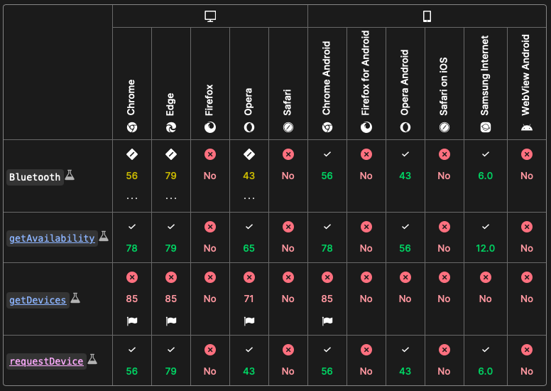

# Web Bluetooth

## Why Web Bluetooth?
Since we are using a PWA, we do not have access to the device's native bluetooth API. This means that we have to use the Web Bluetooth API. The Web Bluetooth API is a browser API that allows websites to communicate with Bluetooth Low Energy (BLE) devices.

## Limitations
- Only works on Chrome and Edge
    - Users must download the PWA from a Chrome or Edge browser

## External Resources
- [Connecting a Progressive Web App and ESP32 with Bluetooth](https://cj-hewett.medium.com/connecting-a-progressive-web-app-and-esp32-with-bluetooth-4f9fecb9c5c5)
- [ESP32 Web Bluetooth (BLE): Getting Started Guide](https://randomnerdtutorials.com/esp32-web-bluetooth/)

