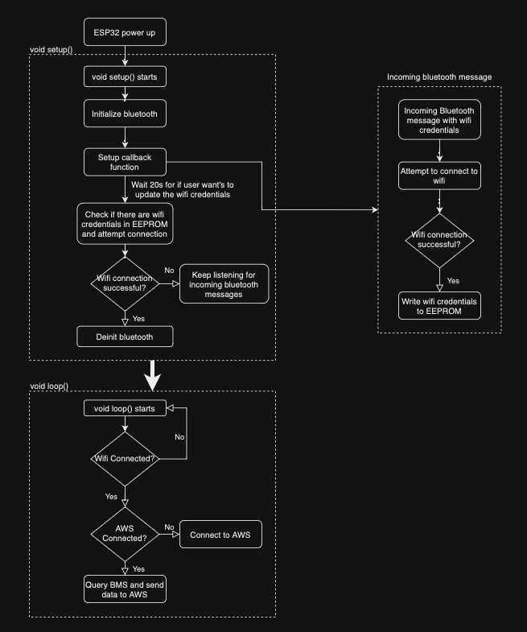

# Bluetooth Wifi Setup
The flowchart below outlines the process for setting up a Wifi connection for the ESP32.
 
Note: the ESP32 is unable to setup an AWS connection while bluetooth is active. To solve this issue, bluetooth is disabled before an AWS connection is made. Bluetooth is not re-enabled until the ESP32 is restarted. If the user would like to update their Wifi credentials, they would have to restart the ESP32 (either by unplugging the ESP32 or by turning the EnergyPak off and on again).

