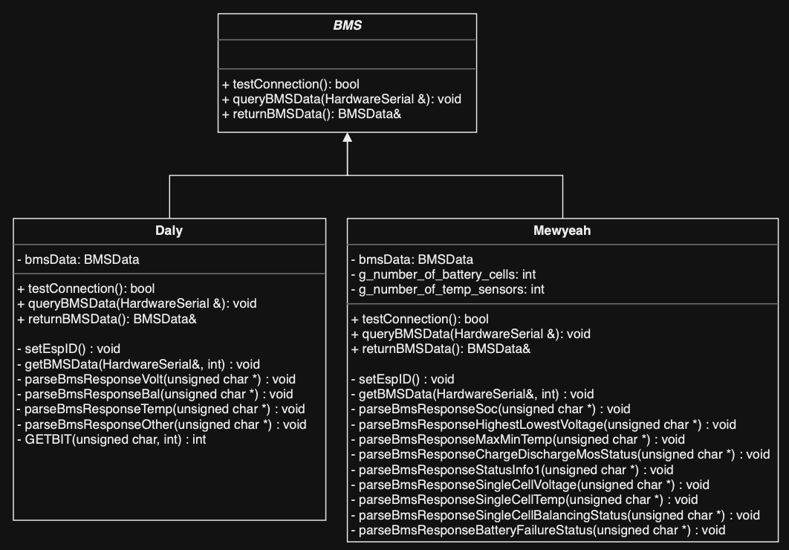

# Code Sharing
Due to having 2 BMS versions, there are a few things that are slightly different between the 2 versions.
- **Communication Protocol**: Mewyeah uses RS232 (36000 baud rate) while Daly uses RS232 (9600 baud rate)
- **Data Retrieval Commands**: Each BMS version has different commands to retrieve data from the BMS, as well as different data formats which require separate methods of parsing

In order to reduce the amount of duplicate code, an object oriented approach is employed, as well as an auto-BMS-detection method. 

## Object Oriented Programming
There is base class called `BMS` which contains all the common code between the 2 versions. We then created 2 subclasses, `MewyeahBMS` and `DalyBMS` which contain the code that is specific to each version. The subclasses inherit from the base class, so they have access to all the common code. The `BMS` class is defined as a pure virtual function, as it does not contain any code that can be run. This means that the `BMS` class cannot be instantiated, and can only be used as a base class for other classes.




## Auto BMS Detection
Initially, the BMS version is instantiated as a Daly BMS. 
```cpp
BMS *bms; // Pointer to base class
bms = new Daly(); // Initially assume it's Daly
```
Then the testConnection() method is called. This method sends a query and waits for a response. If the response is valid, then it returns true. If the response is invalid, then it returns false. 
```cpp
isDaly = bms->testConnection();
```
If the response is invalid, then the BMS version is changed to Mewyeah and the testConnection() method is called again. 
```cpp
if (!isDaly) {
    delete bms; // Delete the Daly instance
    bms = new Mewyeah(); // Now try Mewyeah
    isMewyeah = bms->testConnection();
}
```

## Conclusion
These methods allow the codebase to be compatible with Mewyeah and Daly versions simultaneously. There is no need to change any code or modify any flags.
