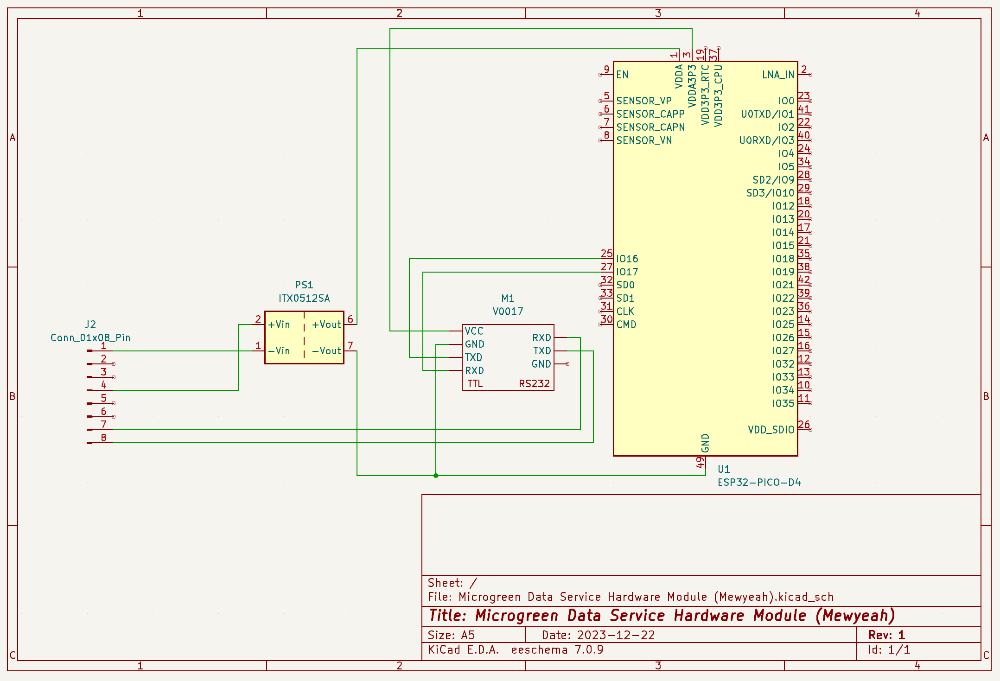
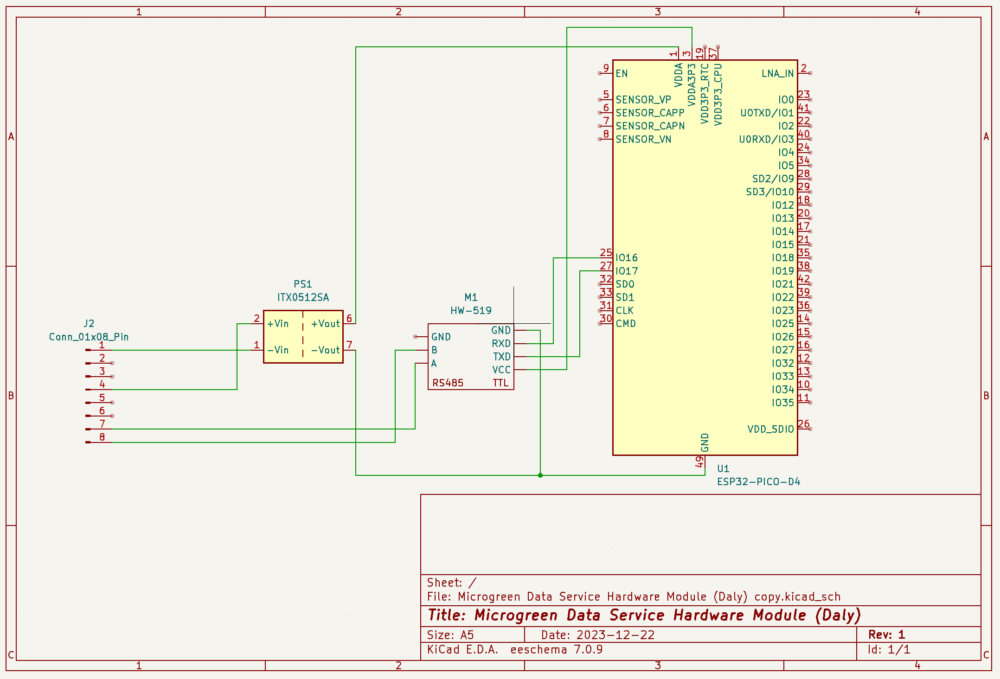
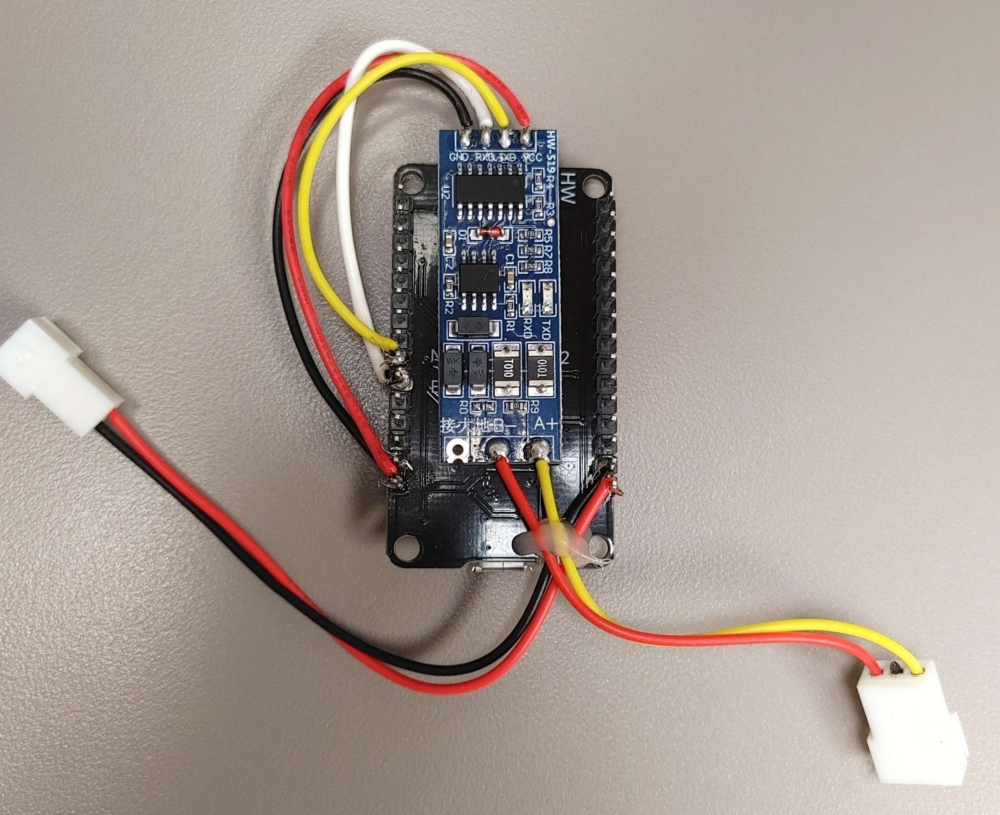
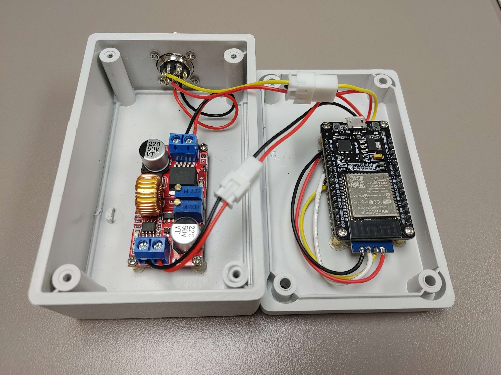
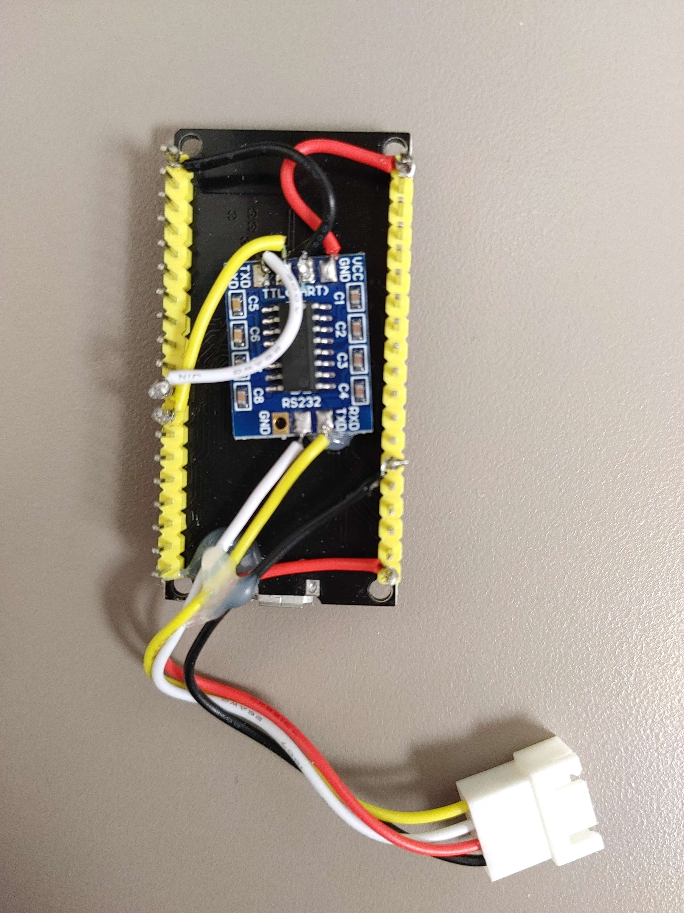
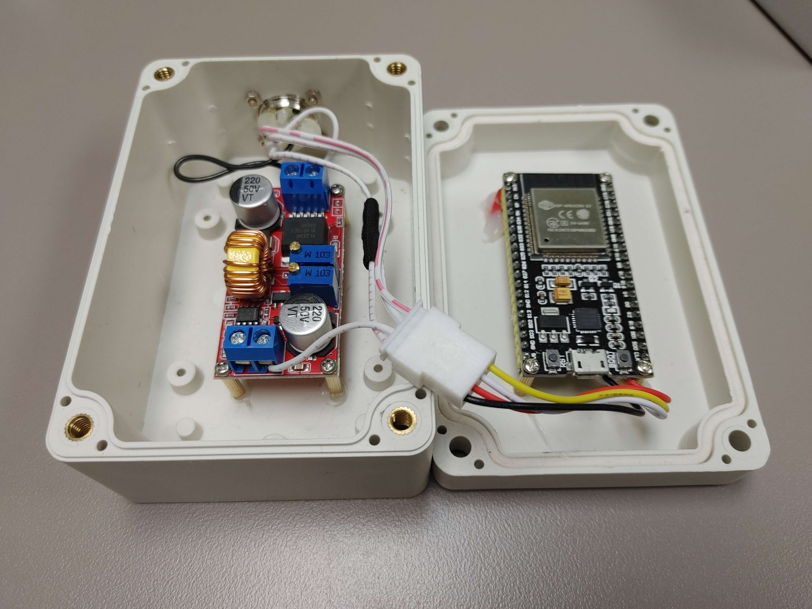

# Hardware Design
### Power
The voltage coming in from pin 4 of the connector has the potential to be anywhere from 5V-48V. To ensure that the ESP32 receives a stable 5V, a buck converter is used to convert the voltage to 5V.

### Communication
Due to the fact that Mewyeah uses the RS232 communication protocol and Daly uses RS485, The hardware design cannot be identical. Instead, there is a TTL-RS232 converter in the Mewyeah design and a TTL-RS485 converter in the Daly design.

## Schematic Diagrams

## Images

